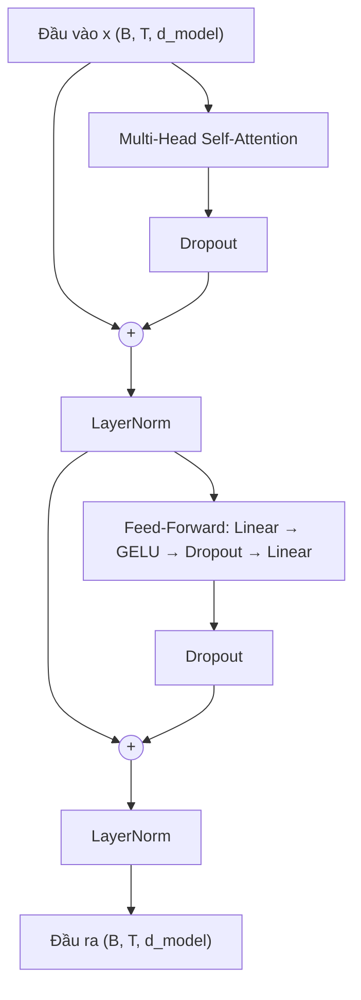
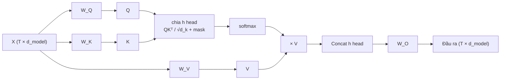
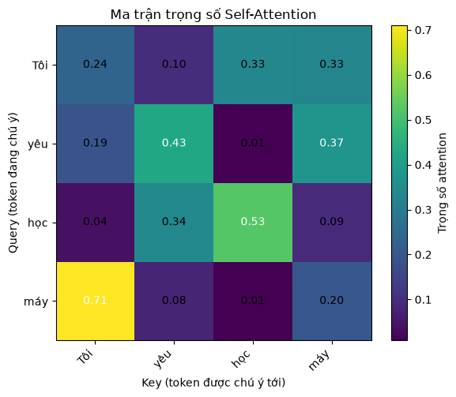

# CHƯƠNG 2: CƠ SỞ LÝ THUYẾT

## 2.1. Tổng quan về bài toán phát hiện bình luận độc hại

Phát hiện bình luận độc hại (toxic comment detection) là bài toán xác định một đoạn văn bản do người dùng tạo ra trên mạng xã hội có chứa nội dung xúc phạm, lăng mạ hay kích động thù ghét hay không [5]. Về mặt hình thức, đây là bài toán phân loại văn bản có giám sát: cho một câu đầu vào $x = (w_1, w_2, \dots, w_T)$ gồm $T$ từ, mô hình cần học ánh xạ $f: x \mapsto y$ với $y$ thuộc tập nhãn hữu hạn.

Trong đề tài này, nhóm sử dụng dataset ViHSD (Vietnamese Hate Speech Detection) [4] với ba nhãn:

- **CLEAN** (0): bình luận bình thường, không chứa nội dung xúc phạm hay thù ghét.
- **OFFENSIVE** (1): bình luận chứa từ ngữ thô tục, xúc phạm nhưng không nhắm vào một cá nhân hay nhóm cụ thể.
- **HATE** (2): bình luận chứa nội dung lăng mạ, thù ghét nhắm vào một cá nhân hoặc nhóm người cụ thể.

Ranh giới giữa OFFENSIVE và HATE vốn không rõ ràng, ngay cả với người gán nhãn [6]. Kết hợp với đặc thù ngôn ngữ mạng xã hội tiếng Việt (từ lóng, teencode, viết tắt, sai chính tả, emoji, từ được "né" kiểm duyệt bằng cách viết lệch) và phân bố nhãn mất cân bằng nghiêm trọng khi phần lớn bình luận là CLEAN, bài toán này có độ khó cao hơn nhiều so với các bài toán phân loại văn bản chuẩn.

## 2.2. Phân loại các phương pháp phát hiện bình luận độc hại

### 2.2.1. Phương pháp dựa trên luật và từ điển

Phương pháp này duy trì một danh sách từ khoá xúc phạm (blacklist) và gán nhãn độc hại cho bình luận chứa các từ đó. Ưu điểm là đơn giản, nhanh, dễ giải thích; nhược điểm là không hiểu ngữ cảnh (cùng một từ có thể mang nghĩa xúc phạm hoặc không tuỳ câu), dễ bị né tránh bằng cách viết lệch từ, và danh sách từ khoá cần cập nhật thủ công liên tục [5].

### 2.2.2. Phương pháp học máy truyền thống

Văn bản được biểu diễn thành vector đặc trưng thủ công như Bag-of-Words, TF-IDF hay n-gram ký tự, sau đó đưa vào các bộ phân loại như Logistic Regression, SVM, Naive Bayes [6]. Cách tiếp cận này học được từ dữ liệu, bền vững hơn phương pháp luật, nhưng biểu diễn thưa và mất thông tin thứ tự từ, khó nắm bắt ngữ nghĩa và quan hệ xa giữa các từ trong câu.

### 2.2.3. Phương pháp học sâu tuần tự (RNN/LSTM, CNN)

Các mô hình học sâu học biểu diễn dày (dense embedding) cho từ và tự trích xuất đặc trưng. Mạng hồi quy RNN/LSTM [7] xử lý câu tuần tự từ trái sang phải, lưu thông tin qua trạng thái ẩn; mạng tích chập TextCNN [8] dùng các bộ lọc trượt để bắt n-gram cục bộ. Hạn chế chung là RNN không song song hoá được theo chiều thời gian và khó học phụ thuộc xa do gradient tiêu biến, còn CNN chỉ nhìn được ngữ cảnh trong phạm vi cửa sổ bộ lọc.

### 2.2.4. So sánh mô hình tuần tự và Transformer

Transformer [1] loại bỏ hoàn toàn cơ chế hồi quy, thay bằng cơ chế **self-attention** cho phép mỗi từ tương tác trực tiếp với mọi từ khác trong câu chỉ qua một phép tính. Bảng 1 tóm tắt sự khác biệt giữa hai nhóm mô hình.

| Tiêu chí | RNN/LSTM | Transformer |
|---|---|---|
| Cách xử lý chuỗi | Tuần tự, từng bước thời gian | Song song toàn bộ chuỗi |
| Độ dài đường đi giữa hai từ bất kỳ | $O(T)$ | $O(1)$ |
| Khả năng học phụ thuộc xa | Hạn chế do gradient tiêu biến | Tốt, attention nối trực tiếp mọi cặp từ |
| Thông tin vị trí | Ngầm định qua thứ tự xử lý | Phải bổ sung tường minh (positional encoding) |
| Chi phí tính toán theo độ dài câu | $O(T \cdot d^2)$ | $O(T^2 \cdot d)$ |
| Yêu cầu dữ liệu | Vừa phải | Lớn; thường cần pretraining để phát huy |

*Bảng 1: So sánh mô hình tuần tự (RNN/LSTM) và Transformer*

Trong phạm vi đề tài này, nhóm lựa chọn tiếp cận theo hướng Transformer Encoder làm nền tảng lý thuyết và thực nghiệm chính. Do bài toán là phân loại (không cần sinh văn bản), chỉ phần Encoder của Transformer được sử dụng, tương tự như cách BERT [2] và PhoBERT [3] được xây dựng.

## 2.3. Kiến trúc Transformer Encoder

Transformer Encoder gồm một lớp embedding, positional encoding, và $N$ lớp encoder giống nhau xếp chồng. Mỗi lớp encoder có hai khối con: Multi-Head Self-Attention và Position-wise Feed-Forward Network, mỗi khối được bọc bởi residual connection và layer normalization (Hình 1).

*Hình 1: Kiến trúc một lớp Transformer Encoder (Post-LN)*

### 2.3.1. Token Embedding

Mỗi từ $w_t$ được ánh xạ thành chỉ số nguyên trong từ điển, sau đó tra bảng embedding $E \in \mathbb{R}^{|V| \times d_{model}}$ để thu được vector dày $e_t \in \mathbb{R}^{d_{model}}$. Theo bài báo gốc [1], vector embedding được nhân thêm hệ số $\sqrt{d_{model}}$ để có độ lớn tương đương positional encoding khi cộng lại.

### 2.3.2. Positional Encoding

Do self-attention không phân biệt thứ tự các từ (hoán vị các từ đầu vào chỉ làm hoán vị đầu ra tương ứng), thông tin vị trí phải được bổ sung tường minh. Transformer gốc dùng positional encoding dạng hình sin [1]:

$$PE_{(pos, 2i)} = \sin\left(\frac{pos}{10000^{2i/d_{model}}}\right), \qquad PE_{(pos, 2i+1)} = \cos\left(\frac{pos}{10000^{2i/d_{model}}}\right)$$

trong đó $pos$ là vị trí của từ trong câu và $i$ là chỉ số chiều. Mỗi chiều tương ứng một sóng sin với bước sóng từ $2\pi$ đến $10000 \cdot 2\pi$, giúp mô hình biểu diễn được cả vị trí tuyệt đối lẫn khoảng cách tương đối giữa các từ, vì $PE_{pos+k}$ có thể biểu diễn bằng một phép biến đổi tuyến tính của $PE_{pos}$. Positional encoding không có tham số học, được cộng trực tiếp vào embedding: $x_t = \sqrt{d_{model}} \cdot e_t + PE_t$.

### 2.3.3. Scaled Dot-Product Attention và Multi-Head Attention

Với ma trận đầu vào $X \in \mathbb{R}^{T \times d_{model}}$, self-attention chiếu $X$ thành ba ma trận Query, Key, Value qua các ma trận trọng số học được:

$$Q = XW_Q, \quad K = XW_K, \quad V = XW_V$$

Sau đó tính:

$$\text{Attention}(Q, K, V) = \text{softmax}\left(\frac{QK^\top}{\sqrt{d_k}} + M\right)V$$

Phần tử $(i, j)$ của $QK^\top$ đo mức độ liên quan giữa từ thứ $i$ (đóng vai trò truy vấn) và từ thứ $j$ (đóng vai trò khoá). Hệ số $\sqrt{d_k}$ giữ phương sai của tích vô hướng ổn định khi $d_k$ lớn, tránh softmax bị bão hoà làm gradient gần bằng 0 [1]. Ma trận mask $M$ nhận giá trị $-\infty$ tại các vị trí đệm `<pad>` và $0$ tại các vị trí khác, để sau softmax trọng số chú ý vào phần đệm bằng 0.

Thay vì một phép attention duy nhất, **Multi-Head Attention** chia không gian $d_{model}$ thành $h$ "đầu" (head) có kích thước $d_k = d_{model}/h$, mỗi head học một kiểu quan hệ khác nhau giữa các từ (ví dụ quan hệ cú pháp, quan hệ đồng tham chiếu, từ phủ định), sau đó ghép kết quả và chiếu lại:

$$\text{MultiHead}(X) = \text{Concat}(\text{head}_1, \dots, \text{head}_h)W_O, \qquad \text{head}_i = \text{Attention}(XW_Q^{(i)}, XW_K^{(i)}, XW_V^{(i)})$$

*Hình 2: Cơ chế Multi-Head Self-Attention*

Để minh hoạ trực quan, nhóm cài đặt self-attention từng bước bằng NumPy trên câu ví dụ "Tôi yêu học máy" (notebook `demo.ipynb`, trọng số khởi tạo ngẫu nhiên, chưa huấn luyện). Mỗi hàng của ma trận trọng số là một phân phối xác suất cho biết token truy vấn "chú ý" bao nhiêu đến từng token còn lại, tổng mỗi hàng bằng 1 (Hình 3).

*Hình 3: Ma trận trọng số self-attention trên câu ví dụ "Tôi yêu học máy"*

### 2.3.4. Position-wise Feed-Forward Network

Sau attention, mỗi vị trí được đưa độc lập qua một mạng nơ-ron hai tầng với cùng bộ trọng số:

$$\text{FFN}(x) = W_2 \, \phi(W_1 x + b_1) + b_2$$

với $W_1 \in \mathbb{R}^{d_{model} \times d_{ff}}$, $W_2 \in \mathbb{R}^{d_{ff} \times d_{model}}$, thường chọn $d_{ff} = 4 \cdot d_{model}$. Bài báo gốc dùng hàm kích hoạt ReLU; đề tài dùng GELU [12] theo cách của BERT [2]. Nếu attention đóng vai trò "trộn" thông tin giữa các vị trí, FFN đóng vai trò biến đổi phi tuyến biểu diễn tại từng vị trí.

### 2.3.5. Residual Connection và Layer Normalization

Mỗi khối con được bọc bởi residual connection [9] và layer normalization [10]. Theo kiến trúc Post-LN của bài báo gốc [1]:

$$x' = \text{LayerNorm}(x + \text{Dropout}(\text{MultiHead}(x)))$$
$$y = \text{LayerNorm}(x' + \text{Dropout}(\text{FFN}(x')))$$

Residual connection giúp gradient truyền trực tiếp qua nhiều lớp, còn LayerNorm chuẩn hoá mỗi vector theo trung bình và độ lệch chuẩn trên chiều đặc trưng, giúp quá trình huấn luyện ổn định. Một biến thể phổ biến là Pre-LN, đặt LayerNorm trước mỗi khối con; Xiong và cộng sự [11] chỉ ra Pre-LN có gradient ổn định hơn ở giai đoạn đầu huấn luyện và ít phụ thuộc vào warm-up, trong khi Post-LN thường cần warm-up learning rate cẩn thận.

## 2.4. Huấn luyện và đánh giá mô hình phân loại

### 2.4.1. Hàm mất mát có trọng số lớp

Với đầu ra logits $z \in \mathbb{R}^C$ của $C$ lớp, xác suất dự đoán là $p = \text{softmax}(z)$. Hàm cross-entropy có trọng số lớp được định nghĩa:

$$\mathcal{L} = -\frac{\sum_{n} w_{y_n} \log p_{n, y_n}}{\sum_{n} w_{y_n}}, \qquad w_c = \frac{N}{C \cdot N_c}$$

trong đó $N$ là tổng số mẫu và $N_c$ là số mẫu của lớp $c$. Trọng số $w_c$ lớn hơn cho lớp thiểu số giúp mô hình không bị "lười" dự đoán toàn bộ là lớp đa số, vốn là hiện tượng phổ biến trên dữ liệu mất cân bằng như ViHSD.

### 2.4.2. Bộ tối ưu Adam và lịch học Noam

Transformer thường được huấn luyện bằng Adam [13] với lịch học Noam gồm giai đoạn warm-up tăng tuyến tính rồi giảm theo căn nghịch đảo của số bước [1]:

$$lr(step) = d_{model}^{-0.5} \cdot \min\left(step^{-0.5}, \; step \cdot warmup^{-1.5}\right)$$

Giai đoạn warm-up tránh cập nhật quá lớn khi trọng số còn ngẫu nhiên và các ước lượng moment của Adam chưa ổn định, đặc biệt quan trọng với kiến trúc Post-LN [11]. Ngoài ra, gradient clipping theo chuẩn [16] được dùng để giới hạn độ lớn gradient, tránh bùng nổ gradient trong các bước đầu.

### 2.4.3. Các độ đo đánh giá

Với mỗi lớp $c$, gọi $TP_c$, $FP_c$, $FN_c$ lần lượt là số mẫu dự đoán đúng là $c$, dự đoán nhầm thành $c$, và bỏ sót lớp $c$:

$$\text{Precision}_c = \frac{TP_c}{TP_c + FP_c}, \quad \text{Recall}_c = \frac{TP_c}{TP_c + FN_c}, \quad F1_c = \frac{2 \cdot \text{Precision}_c \cdot \text{Recall}_c}{\text{Precision}_c + \text{Recall}_c}$$

$$\text{Macro-F1} = \frac{1}{C}\sum_{c=1}^{C} F1_c$$

Trên dữ liệu mất cân bằng, accuracy có thể cao một cách "ảo": một mô hình luôn dự đoán CLEAN vẫn đạt khoảng 83% accuracy trên ViHSD nhưng hoàn toàn vô dụng. Vì vậy, đề tài dùng **macro-F1** làm độ đo chính, do nó coi trọng ngang nhau cả ba lớp, kể cả hai lớp thiểu số OFFENSIVE và HATE. Đây cũng là độ đo được tác giả dataset ViHSD sử dụng [4].
