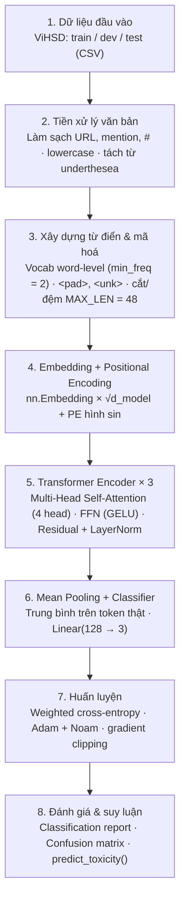
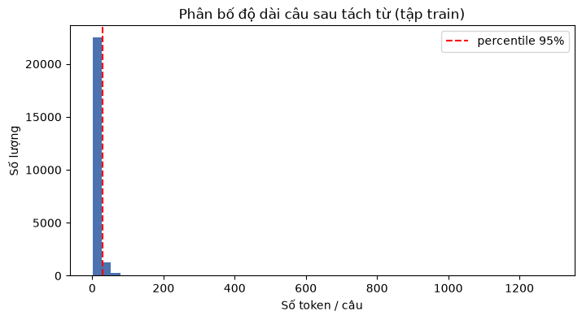
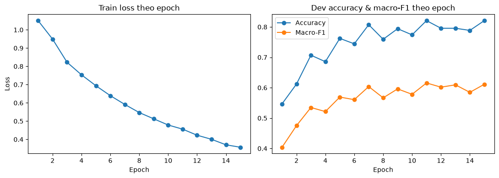
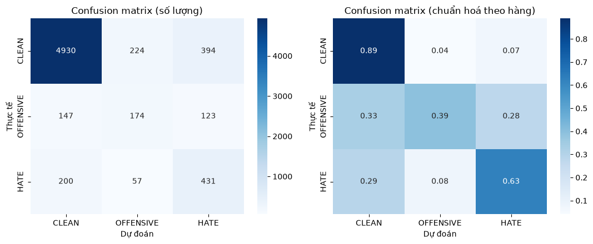
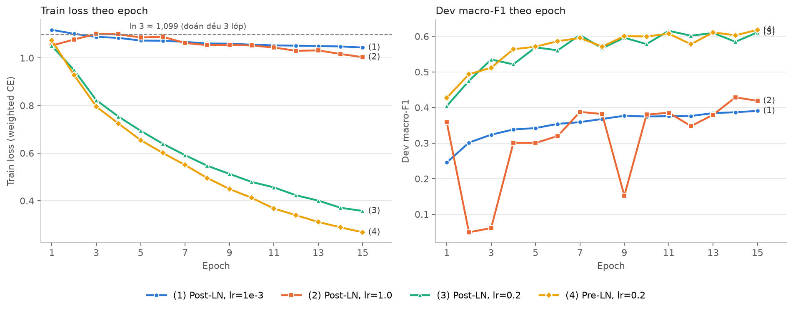

# CHƯƠNG 3: GIẢI PHÁP

## 3.1. Một số kiến trúc tham khảo

Trước khi lựa chọn kiến trúc cài đặt, nhóm đã khảo sát các nhóm kiến trúc phổ biến cho bài toán phát hiện bình luận độc hại, tổng hợp trong Bảng 2. Việc so sánh giúp làm rõ vị trí của giải pháp trong đề tài: một Transformer Encoder tối giản, tự cài đặt và huấn luyện từ đầu, tập trung vào việc hiểu rõ cơ chế bên trong thay vì tối đa hoá độ chính xác.

| Kiến trúc | Biểu diễn đầu vào | Ưu điểm | Nhược điểm |
|---|---|---|---|
| TF-IDF + SVM / Logistic Regression | Vector thưa n-gram từ/ký tự | Nhanh, ít dữ liệu vẫn chạy được, dễ giải thích | Mất thứ tự từ, không hiểu ngữ cảnh, nhạy với biến thể chính tả |
| BiLSTM / TextCNN [7], [8] | Word embedding (ngẫu nhiên hoặc pretrained) | Học được đặc trưng tự động, bắt được n-gram và ngữ cảnh cục bộ | RNN khó song song hoá, khó học phụ thuộc xa; CNN bị giới hạn bởi cửa sổ lọc |
| Fine-tune PhoBERT [3] | Subword BPE, Transformer 12 lớp pretrained trên ~20GB văn bản tiếng Việt | Tận dụng tri thức ngôn ngữ có sẵn, thường cho kết quả tốt nhất | Mô hình lớn (~135 triệu tham số), cần GPU; bản chất bên trong bị che bởi thư viện |
| **Giải pháp trong đề tài** | Từ điển mức từ tự xây từ tập train, embedding khởi tạo ngẫu nhiên | Tự cài đặt toàn bộ Transformer Encoder, minh hoạ trọn vẹn cơ chế attention; nhỏ gọn (~1,8 triệu tham số), chạy được trên laptop | Không có tri thức tiền huấn luyện; chỉ học từ ~24 nghìn câu nên độ chính xác thấp hơn đáng kể |

*Bảng 2: So sánh một số kiến trúc phát hiện bình luận độc hại và giải pháp trong đề tài*

Từ bảng so sánh có thể thấy các mô hình mạnh nhất hiện nay đều dựa trên Transformer được tiền huấn luyện trên corpus lớn. Giải pháp trong đề tài chủ động loại bỏ bước tiền huấn luyện và tự cài đặt mọi thành phần, xem đây là bước nền tảng cần nắm vững trước khi sử dụng các mô hình pretrained. Hướng mở rộng cụ thể được thảo luận ở mục 4.3.

## 3.2. Sơ đồ tổng quát giải pháp

Giải pháp được trình bày dưới dạng một pipeline gồm tám khối xử lý: tải dữ liệu, tiền xử lý văn bản, xây dựng từ điển và mã hoá câu, embedding và positional encoding, Transformer Encoder, mean pooling và phân loại, huấn luyện, đánh giá và suy luận (Hình 4).



*Hình 4: Sơ đồ tổng quát pipeline phát hiện bình luận độc hại*

### 3.2.1. Khối tiếp nhận và tiền xử lý dữ liệu

Khối này tải dataset ViHSD từ kho mã nguồn của tác giả [4] (nếu chưa có sẵn) và đọc ba tập train, dev, test. Mỗi bình luận được làm sạch qua các bước: loại bỏ đường dẫn URL, loại bỏ mention dạng `@tên`, loại bỏ ký tự `#`, gộp khoảng trắng thừa và chuyển về chữ thường.

Do tiếng Việt là ngôn ngữ đơn lập, một từ có nghĩa có thể gồm nhiều âm tiết (ví dụ "việt nam", "lò xo"), văn bản sau làm sạch được tách từ bằng thư viện underthesea [17]; các âm tiết của cùng một từ ghép được nối bằng dấu `_` (ví dụ `việt_nam`, `lò_xo`). Việc tách từ là bước tiền xử lý dữ liệu, không phải một phần của mô hình Transformer. Các câu bị rỗng sau khi làm sạch (ví dụ bình luận chỉ gồm một URL) bị loại bỏ, vì một chuỗi toàn `<pad>` sẽ làm toàn bộ attention mask bằng $-\infty$, gây lỗi NaN khi huấn luyện.

### 3.2.2. Khối xây dựng từ điển và mã hoá câu

Vì không dùng tokenizer có sẵn, nhóm tự xây từ điển mức từ (word-level) **chỉ từ tập train** để tránh rò rỉ thông tin từ tập dev/test. Các từ xuất hiện ít hơn `MIN_FREQ = 2` lần bị loại để giảm kích thước từ điển và tránh mô hình ghi nhớ các từ chỉ xuất hiện một lần. Hai token đặc biệt được thêm vào: `<pad>` (id = 0) dùng để đệm câu ngắn, và `<unk>` (id = 1) thay cho các từ không có trong từ điển.

Mỗi câu được chuyển thành dãy chỉ số, cắt bớt nếu dài hơn `MAX_LEN` và đệm `<pad>` nếu ngắn hơn, tạo thành tensor có kích thước cố định để xử lý theo batch.

### 3.2.3. Khối Embedding và Positional Encoding

Dãy chỉ số được tra bảng `nn.Embedding` (với `padding_idx = 0` để vector của `<pad>` luôn bằng 0 và không được cập nhật), nhân hệ số $\sqrt{d_{model}}$, sau đó cộng với positional encoding hình sin (mục 2.3.2). Ma trận positional encoding được tính một lần khi khởi tạo và lưu bằng `register_buffer`, nên không phải là tham số học.

### 3.2.4. Khối Transformer Encoder

Khối này gồm $N = 3$ lớp encoder giống nhau, mỗi lớp được tự cài đặt theo đúng mô tả ở mục 2.3:

- `MultiHeadSelfAttention`: bốn phép chiếu $W_Q, W_K, W_V, W_O$ bằng `nn.Linear`; tensor được tách thành $h$ head bằng `view` và `transpose`; điểm attention được chia cho $\sqrt{d_k}$, các vị trí `<pad>` bị gán $-\infty$ bằng `masked_fill` trước softmax.
- `FeedForward`: `Linear(d_model → d_ff)` → GELU → Dropout → `Linear(d_ff → d_model)`.
- `TransformerEncoderLayer`: ghép hai khối trên theo kiến trúc Post-LN, mỗi khối có residual connection, dropout và LayerNorm.

Mask `<pad>` có kích thước $(B, 1, 1, T)$ để broadcast cho mọi head và mọi vị trí truy vấn.

### 3.2.5. Khối Mean Pooling và phân loại

Khác với BERT, mô hình không có token `[CLS]` được tiền huấn luyện để đại diện cho cả câu. Vì vậy biểu diễn câu được tạo bằng **mean pooling** trên các vector đầu ra của những token thật (bỏ qua `<pad>`):

$$h_{\text{câu}} = \frac{\sum_{t=1}^{T} m_t \, h_t}{\sum_{t=1}^{T} m_t}, \qquad m_t = \begin{cases} 1 & \text{nếu token } t \text{ không phải } \texttt{<pad>} \\ 0 & \text{ngược lại} \end{cases}$$

Vector $h_{\text{câu}} \in \mathbb{R}^{d_{model}}$ được đưa qua một lớp `nn.Linear(d_model, 3)` để thu được logits cho ba lớp CLEAN, OFFENSIVE, HATE.

### 3.2.6. Khối huấn luyện, đánh giá và suy luận

Vòng lặp huấn luyện được viết tay, không dùng `Trainer` của các thư viện bậc cao. Mỗi bước gồm: lan truyền thuận, tính weighted cross-entropy (mục 2.4.1), lan truyền ngược, gradient clipping với chuẩn tối đa 1,0, cập nhật bằng Adam, và cập nhật learning rate theo lịch Noam (mục 2.4.2). Sau mỗi epoch, mô hình được đánh giá trên tập dev; trọng số có **macro-F1 trên dev cao nhất** được giữ lại để đánh giá cuối cùng trên tập test.

Hàm `predict_toxicity()` thực hiện suy luận trên một câu mới qua đúng chuỗi xử lý như lúc huấn luyện (làm sạch → tách từ → mã hoá → mô hình → softmax), trả về nhãn dự đoán kèm xác suất của từng lớp.

## 3.3. Thư viện sử dụng và môi trường cài đặt

### 3.3.1. Thư viện sử dụng

Toàn bộ pipeline được cài đặt bằng Python và chạy trong Jupyter Notebook (`src/vihsd_transformer_from_scratch.ipynb`). Các hàm dùng chung (tải dữ liệu, tiền xử lý, đánh giá) được tách thành package `src/core` để tái sử dụng giữa các notebook. Bảng 3 liệt kê các thư viện chính, phiên bản thực tế trong môi trường thực nghiệm và vai trò của từng thư viện.

| Thư viện | Phiên bản | Vai trò trong pipeline |
|---|---|---|
| Python | 3.13.7 | Ngôn ngữ cài đặt toàn bộ pipeline, chạy trong Jupyter Notebook |
| PyTorch [18] | 2.14.0 | Chỉ dùng các khối cơ bản (`nn.Linear`, `nn.Embedding`, `nn.LayerNorm`, `nn.Dropout`, `torch.optim`) để tự cài đặt Transformer; tăng tốc bằng Apple MPS |
| underthesea [17] | 9.5.0 | Tách từ tiếng Việt (`word_tokenize`) ở bước tiền xử lý |
| pandas | 3.0.6 | Đọc CSV, quản lý dữ liệu dạng bảng |
| NumPy | 2.5.3 | Tính toán mảng, xử lý kết quả dự đoán |
| scikit-learn | 1.9.1 | Tính class weight, accuracy, F1, classification report, confusion matrix |
| Matplotlib | 3.11.2 | Vẽ phân bố độ dài câu, đường huấn luyện |
| seaborn | 0.13.2 | Vẽ heatmap confusion matrix |
| tqdm | 4.70.1 | Hiển thị tiến trình tiền xử lý và huấn luyện |
| HuggingFace transformers | 5.17.0 | **Chỉ dùng cho mốc tham chiếu** fine-tune PhoBERT (mục 3.4.5), không dùng trong mô hình chính |

*Bảng 3: Danh sách thư viện sử dụng*

Mô hình chính **không** sử dụng `nn.MultiheadAttention`, `nn.TransformerEncoder`, `nn.TransformerEncoderLayer`, thư viện HuggingFace `transformers`, hay bất kỳ embedding/mô hình pretrained nào.

### 3.3.2. Môi trường cài đặt

Thực nghiệm được chạy trên macOS 26.6.2, chip Apple M1 Pro, RAM 16GB, sử dụng backend MPS (Metal Performance Shaders) của PyTorch để tăng tốc trên GPU tích hợp. Toàn bộ thư viện được cài trong một môi trường ảo venv riêng, tách khỏi Python hệ thống, để tránh xung đột phiên bản và bảo đảm khả năng tái lập. Các bước thiết lập môi trường:

```bash
python3 -m venv .venv
source .venv/bin/activate
pip install --upgrade pip
pip install -r requirements.txt
python -m ipykernel install --user --name demo-transformer --display-name "Python (demo-transformer)"
```

Seed ngẫu nhiên được cố định (`SEED = 42`) cho `random`, NumPy và PyTorch. Tuy nhiên, một số phép tính trên backend MPS không đảm bảo tất định tuyệt đối, nên hai lần chạy cùng cấu hình vẫn có thể lệch nhau nhỏ (xem mục 3.4.4). Thông tin chi tiết của lần chạy thực nghiệm được tổng hợp trong Bảng 5.

## 3.4. Thực nghiệm

### 3.4.1. Môi trường và thiết lập thực nghiệm

Nhóm sử dụng dataset ViHSD [4] gồm 33.400 bình luận tiếng Việt thu thập từ Facebook và YouTube, giữ nguyên cách chia train/dev/test của tác giả. Phân bố nhãn được trình bày trong Bảng 4: lớp CLEAN chiếm khoảng 83%, trong khi OFFENSIVE chỉ chiếm khoảng 7% và HATE khoảng 10%, cho thấy dữ liệu mất cân bằng nghiêm trọng.

| Tập | CLEAN | OFFENSIVE | HATE | Tổng |
|---|---|---|---|---|
| Train | 19.886 (82,7%) | 1.606 (6,7%) | 2.556 (10,6%) | 24.048 |
| Dev | 2.190 (82,0%) | 212 (7,9%) | 270 (10,1%) | 2.672 |
| Test | 5.548 (83,1%) | 444 (6,6%) | 688 (10,3%) | 6.680 |
| **Tổng** | **27.624** | **2.262** | **3.514** | **33.400** |

*Bảng 4: Phân bố nhãn của dataset ViHSD*

Notebook được chạy tuần tự theo đúng thứ tự cell: cài thư viện, tải dữ liệu, tiền xử lý, xây từ điển, tạo `DataLoader`, khai báo kiến trúc, cấu hình mô hình, huấn luyện 15 epoch, đánh giá trên tập test, lưu mô hình và demo suy luận. Bảng 5 tổng hợp các siêu tham số của lần chạy.

| Thông số | Giá trị |
|---|---|
| Ngưỡng tần suất từ (MIN_FREQ) | 2 |
| Độ dài câu tối đa (MAX_LEN) | 48 token |
| Kích thước từ điển (VOCAB_SIZE) | 9.428 |
| Số chiều mô hình (D_MODEL) | 128 |
| Số head attention (N_HEADS) | 4 ($d_k = 32$) |
| Số chiều feed-forward (D_FF) | 512 |
| Số lớp encoder (N_LAYERS) | 3 |
| Dropout | 0,1 |
| Batch size (train / dev, test) | 32 / 64 |
| Số epoch (EPOCHS) | 15 |
| Optimizer | Adam, $\beta = (0{,}9;\ 0{,}98)$, $\epsilon = 10^{-9}$ |
| Lịch học | Noam qua `LambdaLR` với hệ số `lr = 0,2` (LR đỉnh ~$5{,}3 \times 10^{-4}$), warm-up 1.128 bước (10% tổng số bước) |
| Gradient clipping | max norm = 1,0 |
| Hàm mất mát | Cross-entropy có trọng số lớp (0,4031; 4,9911; 3,1360) |
| Tiêu chí chọn mô hình | Macro-F1 cao nhất trên tập dev |
| Seed | 42 |

*Bảng 5: Thông số cấu hình thực nghiệm*

### 3.4.2. Quá trình thực hiện qua từng bước

Phần này bám theo sơ đồ tổng quát ở mục 3.2 và minh hoạ cách chương trình xử lý dữ liệu thực tế qua từng bước.

**Bước 1: Tải và đọc dữ liệu.**

Hàm `load_vihsd()` kiểm tra thư mục `data/vihsd`; nếu chưa có dữ liệu, chương trình tải file `vihsd.zip` từ kho mã nguồn của tác giả và giải nén. Ba file `train.csv`, `dev.csv`, `test.csv` được đọc bằng pandas, mỗi file gồm hai cột `free_text` (nội dung bình luận) và `label_id` (nhãn 0/1/2). Kích thước thu được là 24.048 / 2.672 / 6.680 dòng.

**Bước 2: Tiền xử lý văn bản.**

Hàm `preprocess_df()` áp dụng `clean_text()` và `segment_text()` cho từng bình luận. Ví dụ một bình luận trong tập train:

- Gốc: "Đúng là bọn mắt híp lò xo thụt :))) bên việt nam t cái này ra cách đây 10 năm r và bọn t gọi là cái l :)))"
- Sau tiền xử lý: `đúng là bọn mắt híp lò_xo thụt :))) bên việt_nam t cái này ra cách đây 10 năm r và bọn t gọi_là cái l :)))`

Có thể thấy các từ ghép như `lò_xo`, `việt_nam`, `gọi_là` được nhận diện đúng, trong khi các từ viết tắt đặc trưng của mạng xã hội ("t", "r", "l") và emoticon ":)))" được giữ nguyên. Sau bước này có 1 dòng trong tập train bị loại do rỗng sau khi làm sạch; tập dev và test không có dòng nào bị loại. Toàn bộ bước tiền xử lý ba tập mất khoảng 36 giây.

**Bước 3: Xây dựng từ điển và chọn độ dài câu.**

Tập train có 24.448 từ phân biệt; sau khi loại các từ xuất hiện dưới 2 lần, từ điển còn 9.428 token (gồm `<pad>` và `<unk>`). Mười token phổ biến nhất là `.`, `,`, `là`, `có`, `mà`, `cho`, `thì`, `đi`, `này`, `:`, chủ yếu là dấu câu và hư từ.

Để chọn `MAX_LEN`, nhóm khảo sát phân bố độ dài câu sau tách từ trên tập train (Hình 5). Độ dài trung bình là 10,8 token, trung vị 8 token, percentile 95% là 30 token và percentile 99% là 57 token; phân phối lệch phải mạnh với câu dài nhất lên đến 1.290 token. Giá trị `MAX_LEN = 48` bao phủ hơn 95% số câu; trên tập test chỉ có 1,7% số câu bị cắt bớt.



*Hình 5: Phân bố độ dài câu (số token) sau tách từ trên tập train*

Với câu ví dụ ở Bước 2, kết quả mã hoá là dãy 26 chỉ số token thật, tiếp theo là 22 chỉ số `0` (`<pad>`). Từ ghép `lò_xo` xuất hiện dưới 2 lần trong tập train nên không có trong từ điển và được mã hoá thành `1` (`<unk>`). Trên tập test, tỉ lệ token bị mã hoá thành `<unk>` là 8,4%.

**Bước 4: Tạo Dataset và DataLoader.**

Lớp `ViHSDDataset` mã hoá trước toàn bộ câu thành danh sách chỉ số, phương thức `__getitem__` trả về cặp tensor (input_ids, label). `DataLoader` chia dữ liệu thành 752 batch train (batch size 32, có xáo trộn), 42 batch dev và 105 batch test (batch size 64, không xáo trộn).

**Bước 5: Khởi tạo mô hình.**

Mô hình `TransformerClassifier` được khởi tạo với cấu hình ở Bảng 5, có tổng cộng **1.801.987 tham số** huấn luyện được, phân bổ như sau:

- Lớp embedding: $9.428 \times 128 = 1.206.784$ tham số (chiếm khoảng 67%).
- Mỗi lớp encoder có 198.272 tham số, gồm multi-head attention 66.048, feed-forward 131.712 và hai LayerNorm 512. Ba lớp encoder có tổng cộng 594.816 tham số.
- Lớp phân loại: $128 \times 3 + 3 = 387$ tham số.

Class weight tính theo công thức ở mục 2.4.1 là 0,4031 cho CLEAN, 4,9911 cho OFFENSIVE và 3,1360 cho HATE, tức một mẫu OFFENSIVE có trọng số gấp khoảng 12 lần một mẫu CLEAN trong hàm mất mát.

**Bước 6: Huấn luyện.**

Mô hình được huấn luyện 15 epoch, tổng cộng 11.280 bước cập nhật, trong đó 1.128 bước đầu là warm-up. Với hệ số `lr = 0,2` của `LambdaLR`, learning rate thực tế tăng tuyến tính đến đỉnh khoảng $5{,}3 \times 10^{-4}$ ở cuối warm-up, sau đó giảm dần còn khoảng $1{,}7 \times 10^{-4}$ ở bước cuối (cách chọn hệ số này được trình bày ở mục 3.4.4). Toàn bộ quá trình huấn luyện trên Apple M1 Pro (MPS) mất khoảng **3 phút 35 giây**, trung bình khoảng 14 giây mỗi epoch, bao gồm cả đánh giá trên dev. Kết quả từng epoch được ghi lại trong Bảng 6 và Hình 6.

| Epoch | Train loss | Dev accuracy | Dev macro-F1 |
|---|---|---|---|
| 1 | 1,0502 | 0,5468 | 0,4040 |
| 2 | 0,9490 | 0,6119 | 0,4750 |
| 3 | 0,8225 | 0,7070 | 0,5349 |
| 4 | 0,7536 | 0,6856 | 0,5214 |
| 5 | 0,6938 | 0,7624 | 0,5691 |
| 6 | 0,6393 | 0,7444 | 0,5607 |
| 7 | 0,5914 | 0,8073 | 0,6037 |
| 8 | 0,5469 | 0,7594 | 0,5667 |
| 9 | 0,5127 | 0,7942 | 0,5960 |
| 10 | 0,4788 | 0,7740 | 0,5783 |
| **11** | **0,4561** | **0,8207** | **0,6156** |
| 12 | 0,4229 | 0,7957 | 0,6018 |
| 13 | 0,4005 | 0,7957 | 0,6095 |
| 14 | 0,3704 | 0,7885 | 0,5847 |
| 15 | 0,3570 | 0,8207 | 0,6113 |

*Bảng 6: Kết quả huấn luyện trên tập dev theo epoch*



*Hình 6: Train loss, accuracy và macro-F1 trên tập dev theo epoch*

Train loss giảm đều từ 1,0502 xuống 0,3570. Dev macro-F1 tăng nhanh trong 7 epoch đầu, sau đó dao động trong khoảng 0,57–0,62. Trọng số ở epoch 11 (dev macro-F1 = 0,6156) được chọn làm mô hình cuối cùng, sau đó lưu cùng từ điển và cấu hình vào thư mục `models/transformer-scratch-vihsd/` (`model_state_dict.pt`, `vocab.json`, `config.json`).

**Bước 7: Đánh giá trên tập test và suy luận.**

Mô hình tốt nhất được đánh giá trên 6.680 mẫu của tập test, cho kết quả chi tiết ở Bảng 7 và confusion matrix ở Hình 7.

| Lớp | Precision | Recall | F1-score | Support |
|---|---|---|---|---|
| CLEAN | 0,9342 | 0,8886 | 0,9109 | 5.548 |
| OFFENSIVE | 0,3824 | 0,3919 | 0,3871 | 444 |
| HATE | 0,4546 | 0,6265 | 0,5269 | 688 |
| **Macro avg** | **0,5904** | **0,6357** | **0,6083** | 6.680 |
| Weighted avg | 0,8482 | 0,8286 | 0,8365 | 6.680 |
| Accuracy | | | 0,8286 | 6.680 |

*Bảng 7: Kết quả phân loại chi tiết trên tập test*



*Hình 7: Confusion matrix trên tập test (số lượng và chuẩn hoá theo hàng)*

Cuối cùng, hàm `predict_toxicity()` được thử trên ba câu tự viết:

| Câu đầu vào | Nhãn dự đoán | P(CLEAN) | P(OFFENSIVE) | P(HATE) |
|---|---|---|---|---|
| "Video này hay quá, cảm ơn bạn đã chia sẻ nhé" | CLEAN | 0,9940 | 0,0008 | 0,0051 |
| "Thằng ngu này nói chuyện chán vãi" | HATE | 0,0040 | 0,0031 | 0,9929 |
| "Bọn mày là lũ súc vật không hơn không kém" | HATE | 0,0031 | 0,0085 | 0,9884 |

Mô hình phân loại đúng hướng cả ba câu với độ tự tin cao (xác suất lớp dự đoán trên 0,98). Câu "Thằng ngu này nói chuyện chán vãi" được gán HATE vì nhắm vào một người cụ thể; theo định nghĩa của ViHSD, câu này có thể được gán OFFENSIVE hoặc HATE tuỳ người gán nhãn.

### 3.4.3. Kết quả thực nghiệm

Bảng 8 tổng hợp các chỉ số định lượng chính của lần chạy thực nghiệm chính thức.

| Chỉ số | Giá trị | Ghi chú |
|---|---|---|
| Số mẫu train / dev / test | 24.047 / 2.672 / 6.680 | Đã loại 1 dòng rỗng ở train |
| Kích thước từ điển | 9.428 token | Từ 24.448 từ phân biệt, MIN_FREQ = 2 |
| Tỉ lệ `<unk>` trên test | 8,4% | Token không có trong từ điển train |
| Tổng số tham số | 1.801.987 | 67% nằm ở lớp embedding |
| Learning rate đỉnh | ~$5{,}3 \times 10^{-4}$ | Noam, hệ số `lr = 0,2`, warm-up 1.128 bước |
| Thời gian huấn luyện | ~3 phút 35 giây | 15 epoch, Apple M1 Pro (MPS) |
| Train loss (epoch 1 → 15) | 1,0502 → 0,3570 | |
| Dev macro-F1 tốt nhất | 0,6156 | Epoch 11 |
| Test accuracy | 0,8286 | 1.145/6.680 mẫu dự đoán sai (17,1%) |
| **Test macro-F1** | **0,6083** | Độ đo chính |
| F1 CLEAN / OFFENSIVE / HATE (test) | 0,9109 / 0,3871 / 0,5269 | |

*Bảng 8: Kết quả định lượng thực nghiệm*

### 3.4.4. Khảo sát ảnh hưởng của learning rate và vị trí LayerNorm

Trong lần chạy đầu tiên, optimizer được khai báo với `lr = 1e-3`. Do `LambdaLR` **nhân** learning rate ban đầu với giá trị trả về của hàm Noam, trong khi công thức Noam vốn đã là learning rate tuyệt đối, learning rate thực tế chỉ đạt đỉnh $10^{-3} \times 128^{-0{,}5} \times 1128^{-0{,}5} \approx 2{,}6 \times 10^{-6}$. Mô hình khi đó gần như không học được: train loss dừng ở khoảng 1,04, sát giá trị $\ln 3 \approx 1{,}099$ của một bộ phân loại đoán đều ba lớp. Nhóm phát hiện lỗi này khi phân tích kết quả, và thực hiện thêm các lần chạy với cùng dữ liệu, cùng kiến trúc và cùng seed, chỉ thay đổi hệ số learning rate và vị trí LayerNorm (Bảng 9, Hình 8).

| Lần chạy | Kiến trúc | Hệ số `lr` | LR đỉnh | Train loss cuối | Dev macro-F1 tốt nhất (epoch) | Test acc | **Test macro-F1** | F1 CLEAN / OFF / HATE |
|---|---|---|---|---|---|---|---|---|
| (1) | Post-LN | $10^{-3}$ | ~$2{,}6 \times 10^{-6}$ | 1,0435 | 0,3905 (15) | 0,5683 | 0,3780 | 0,716 / 0,141 / 0,277 |
| (2) | Post-LN | 1,0 | ~$2{,}6 \times 10^{-3}$ | 1,0031 | 0,4286 (14) | 0,6576 | 0,4061 | 0,790 / 0,089 / 0,340 |
| **(3)** | **Post-LN** | **0,2** | **~$5{,}3 \times 10^{-4}$** | **0,3570** | **0,6156 (11)** | **0,8286** | **0,6083** | **0,911 / 0,387 / 0,527** |
| (3') | Post-LN, chạy lặp lại | 0,2 | ~$5{,}3 \times 10^{-4}$ | 0,3624 | 0,6153 (11) | 0,8169 | 0,5988 | 0,904 / 0,354 / 0,539 |
| (4) | Pre-LN | 0,2 | ~$5{,}3 \times 10^{-4}$ | 0,2673 | 0,6184 (15) | 0,8365 | 0,6045 | 0,917 / 0,363 / 0,533 |

*Bảng 9: Kết quả khảo sát learning rate và vị trí LayerNorm (cùng dữ liệu, cùng seed, 15 epoch)*



*Hình 8: Train loss và dev macro-F1 theo epoch của bốn cấu hình huấn luyện*

Từ Bảng 9 và Hình 8 có thể rút ra các nhận xét sau:

- **Learning rate quá nhỏ (1):** mô hình underfitting nặng, train loss gần như không giảm, dev macro-F1 chỉ tăng chậm lên 0,39.
- **Learning rate quá lớn (2):** với kiến trúc Post-LN, huấn luyện mất ổn định. Có những epoch mô hình "sụp" về dự đoán gần như toàn bộ là lớp thiểu số (dev accuracy chỉ 8–12% ở epoch 2, 3 và 9), hoặc toàn bộ là CLEAN (dev accuracy đúng bằng tỉ lệ CLEAN 81,96% ở epoch 4–5). Điều này phù hợp với nhận định rằng Post-LN nhạy với learning rate lớn [11].
- **Learning rate phù hợp (3):** hệ số 0,2 cho learning rate đỉnh khoảng $5{,}3 \times 10^{-4}$, gần với mức đỉnh khoảng $7 \times 10^{-4}$ của cấu hình gốc trong [1]. Train loss giảm đều và test macro-F1 tăng từ 0,3780 lên 0,6083. Đây là cấu hình được chọn làm kết quả chính.
- **Pre-LN (4):** cho train loss thấp hơn và đường dev macro-F1 ổn định hơn một chút, nhưng test macro-F1 (0,6045) tương đương Post-LN. Để có Pre-LN, nhóm thêm một LayerNorm cuối (256 tham số) trước bước pooling.
- **Độ dao động giữa các lần chạy:** lần (3') chạy lại đúng cấu hình của lần (3), cùng seed, nhưng test macro-F1 lệch khoảng 0,01 (0,5988 so với 0,6083) do backend MPS không tất định tuyệt đối. Vì chênh lệch giữa Post-LN và Pre-LN ở seed 42 (khoảng 0,004) nhỏ hơn mức dao động này, nhóm chạy thêm hai seed cho mỗi kiến trúc để so sánh đáng tin cậy hơn.

**So sánh Post-LN và Pre-LN qua nhiều seed.** Với cùng hệ số `lr = 0,2`, mỗi kiến trúc được chạy với ba seed 42, 43 và 44 (seed ảnh hưởng đến khởi tạo trọng số và thứ tự xáo trộn dữ liệu). Kết quả được trình bày dưới dạng trung bình ± độ lệch chuẩn mẫu trong Bảng 10.

| Kiến trúc | Dev macro-F1 tốt nhất | Test accuracy | **Test macro-F1** | F1 CLEAN | F1 OFFENSIVE | F1 HATE |
|---|---|---|---|---|---|---|
| Post-LN | 0,6111 ± 0,0049 | 0,8233 ± 0,0047 | **0,6069 ± 0,0080** | 0,9075 ± 0,0037 | 0,3777 ± 0,0180 | 0,5355 ± 0,0123 |
| Pre-LN | 0,6087 ± 0,0098 | 0,8250 ± 0,0158 | **0,6029 ± 0,0072** | 0,9093 ± 0,0094 | 0,3674 ± 0,0082 | 0,5318 ± 0,0069 |

*Bảng 10: So sánh Post-LN và Pre-LN qua 3 seed (42, 43, 44), `lr = 0,2`, 15 epoch*

Test macro-F1 của từng seed lần lượt là 0,6083 / 0,6141 / 0,5983 với Post-LN và 0,6045 / 0,6092 / 0,5950 với Pre-LN. Chênh lệch trung bình giữa hai kiến trúc (0,004) nhỏ hơn độ lệch chuẩn của mỗi kiến trúc (khoảng 0,007–0,008), và khoảng giá trị của hai bên chồng lấn nhau. Do đó, trên bộ dữ liệu và quy mô mô hình này, **không có khác biệt đáng kể** giữa Post-LN và Pre-LN khi learning rate đã được chọn phù hợp. Ưu điểm ổn định của Pre-LN [11] chủ yếu thể hiện ở vùng learning rate lớn hoặc mô hình sâu hơn — những trường hợp đề tài chưa khảo sát.

**Về cách chọn cấu hình cuối cùng.** Toàn bộ việc chọn cấu hình đều dựa trên **tập dev**, tập test chỉ dùng để báo cáo kết quả:

- Hệ số `lr = 0,2` được chọn vì cho dev macro-F1 cao nhất trong ba mức đã thử (0,6156 so với 0,3905 và 0,4286).
- Post-LN được giữ làm kiến trúc chính vì hai lý do. Thứ nhất, trung bình dev macro-F1 qua ba seed của Post-LN (0,6111) không thấp hơn Pre-LN (0,6087). Thứ hai, Post-LN đúng với kiến trúc gốc trong [1], nhất quán với phần lý thuyết ở Chương 2.
- Trong mỗi lần chạy, trọng số được chọn là epoch có dev macro-F1 cao nhất.

Vì nhóm đã xem kết quả test của nhiều cấu hình trong quá trình khảo sát, con số test của cấu hình được chọn có thể hơi lạc quan. Để giảm rủi ro này, nhóm báo cáo kết quả chính dưới dạng khoảng **0,61 ± 0,01** (trung bình ba seed là 0,6069) thay vì chỉ một con số của một lần chạy.

### 3.4.5. Đối chiếu với mô hình pretrained PhoBERT

Để có mốc tham chiếu cho kết quả của mô hình tự cài đặt, nhóm fine-tune mô hình pretrained `vinai/phobert-base` [3] trên cùng cách chia dữ liệu, cùng bước tiền xử lý (làm sạch và tách từ bằng underthesea) và cùng class weight. Phần này được cài đặt trong notebook riêng `src/vihsd_phobert_toxic_detection.ipynb`, dùng thư viện HuggingFace `transformers`, và không phải trọng tâm của đề tài. Cấu hình fine-tune gồm: tokenizer BPE của PhoBERT với độ dài tối đa 96 subword, 4 epoch, batch size 16, learning rate $2 \times 10^{-5}$ với 10% warm-up, weight decay 0,01, chọn checkpoint theo dev macro-F1.

| Tiêu chí | Transformer tự cài đặt (Post-LN, 3 seed) | PhoBERT fine-tune |
|---|---|---|
| Trọng số ban đầu | Ngẫu nhiên | Pretrained trên ~20GB văn bản tiếng Việt |
| Tokenizer | Word-level tự xây (9.428 token) | BPE của PhoBERT (64.001 token) |
| Số lớp encoder / $d_{model}$ | 3 / 128 | 12 / 768 |
| Số tham số | 1.801.987 | 135.000.579 (~75 lần) |
| Thời gian huấn luyện (M1 Pro, MPS) | ~3,5 phút (15 epoch) | ~74 phút (4 epoch) |
| Dev macro-F1 tốt nhất | 0,6111 ± 0,0049 | 0,6734 (epoch 3) |
| Test accuracy | 0,8233 ± 0,0047 | 0,8510 |
| **Test macro-F1** | **0,6069 ± 0,0080** | **0,6539** |
| F1 CLEAN / OFFENSIVE / HATE | 0,908 / 0,378 / 0,536 | 0,927 / 0,440 / 0,596 |

*Bảng 11: So sánh Transformer tự cài đặt với PhoBERT fine-tune trên cùng dữ liệu ViHSD*

PhoBERT cho test macro-F1 cao hơn khoảng 0,047, vượt trội ở cả ba lớp, rõ nhất ở OFFENSIVE (+0,06) và HATE (+0,06). Đây là đóng góp của tri thức ngôn ngữ tiền huấn luyện: PhoBERT đã "biết" nghĩa của từ ngữ tiếng Việt trước khi nhìn thấy dữ liệu ViHSD. Tuy nhiên, khoảng cách này nhỏ hơn nhiều so với chênh lệch về quy mô: mô hình tự cài đặt chỉ có khoảng 1/75 số tham số và thời gian huấn luyện ngắn hơn khoảng 20 lần, nhưng vẫn đạt khoảng 93% macro-F1 của PhoBERT. Ngoài ra, lớp OFFENSIVE là lớp yếu nhất ở **cả hai** mô hình (F1 0,38 và 0,44), cho thấy độ khó của lớp này phần lớn nằm ở bản thân dữ liệu, không chỉ ở mô hình.

## 3.5. Phân tích và đánh giá kết quả

Kết quả tích cực nhất là pipeline chạy hoàn chỉnh từ dữ liệu thô đến suy luận trên câu mới, với toàn bộ thành phần Transformer tự cài đặt. Sau khi điều chỉnh learning rate, mô hình đạt **test macro-F1 = 0,6083** và accuracy 0,8286 ở lần chạy chính thức, trung bình ba seed là 0,6069 ± 0,0080. Kết quả này vượt xa các mốc tham chiếu đơn giản: luôn dự đoán CLEAN cho macro-F1 khoảng 0,30, còn đoán ngẫu nhiên đều ba lớp cho khoảng 0,25. Mô hình phát hiện được 62,7% số bình luận HATE (431/688), và các câu demo được phân loại đúng với độ tự tin cao.

Tuy nhiên, kết quả cũng bộc lộ nhiều hạn chế:

- **Lớp OFFENSIVE vẫn khó phân biệt nhất.** F1 của OFFENSIVE là 0,3871; trong 444 mẫu OFFENSIVE chỉ có 174 mẫu (39,2%) được dự đoán đúng, 147 mẫu (33,1%) bị nhầm thành CLEAN và 123 mẫu (27,7%) bị nhầm thành HATE. Điều này phản ánh cả việc lớp này có ít mẫu nhất (1.606 mẫu train), lẫn ranh giới vốn mơ hồ giữa OFFENSIVE và HATE [6]. Ví dụ câu "Đánh chết mẹ thằng này đi" được gán nhãn OFFENSIVE nhưng mô hình dự đoán HATE — một trường hợp mà chính người gán nhãn cũng có thể không thống nhất.
- **Precision của HATE còn thấp (0,4546).** Có 394/5.548 bình luận CLEAN (7,1%) bị dự đoán là HATE. Đây là đánh đổi của class weight cao cho lớp thiểu số: mô hình ưu tiên "báo động nhầm" hơn là bỏ sót. Nhiều câu bị nhầm là câu ngắn, thiếu ngữ cảnh hoặc chứa từ lóng như "Lú TBT", "Cái này thầy live lúc nài zay tụi bay".
- **Bắt đầu overfitting.** Từ epoch 7 trở đi, train loss vẫn giảm (0,59 → 0,36) nhưng dev macro-F1 không tăng thêm mà dao động quanh 0,57–0,62. Với khoảng 1,8 triệu tham số, trong đó 1,2 triệu nằm ở lớp embedding, mô hình dễ ghi nhớ tập train nhỏ.
- **Nhạy với siêu tham số tối ưu và không tất định.** Mục 3.4.4 cho thấy chỉ riêng hệ số learning rate đã làm test macro-F1 thay đổi từ 0,38 đến 0,61. Ngoài ra, kết quả dao động khoảng ±0,01 giữa các seed và giữa các lần chạy cùng seed, nên chỉ những khác biệt lớn hơn mức này mới có ý nghĩa. Ví dụ, khác biệt giữa Post-LN và Pre-LN (0,004) là không có ý nghĩa.
- **Không có tri thức ngôn ngữ tiền huấn luyện.** Embedding khởi tạo ngẫu nhiên và chỉ học từ khoảng 24 nghìn câu, trong đó phần lớn là CLEAN. Mô hình phải tự suy ra nghĩa xúc phạm của từ ngữ từ số ít mẫu độc hại. So với PhoBERT (mục 3.4.5), mô hình thấp hơn khoảng 0,047 macro-F1, rõ nhất ở hai lớp thiểu số.
- **Hạn chế của từ điển mức từ.** 8,4% token trên tập test bị mã hoá thành `<unk>`, nên một phần tín hiệu có thể bị mất. Ngôn ngữ mạng xã hội còn có nhiều biến thể của cùng một từ. Trong tập train, "nài" chỉ xuất hiện 4 lần so với 1.804 lần của "này", "zay" 8 lần so với 629 lần của "vậy", "wa" 41 lần so với 1.300 lần của "quá". Từ điển mức từ coi chúng là các token hoàn toàn khác nhau, nên embedding của các biến thể hiếm được học rất kém.

Tóm lại, một Transformer Encoder nhỏ, tự cài đặt và huấn luyện từ đầu có thể đạt macro-F1 khoảng 0,61 ± 0,01 trên ViHSD sau khoảng 3,5 phút huấn luyện trên laptop, tương đương khoảng 93% kết quả của PhoBERT fine-tune dù chỉ có khoảng 1/75 số tham số. Tuy nhiên, điều này chỉ đạt được khi learning rate được thiết lập đúng. Hai lớp thiểu số, đặc biệt là OFFENSIVE, vẫn là điểm yếu chính. Đây là những vấn đề mà các hướng phát triển ở mục 4.3 (tiền huấn luyện, tokenizer subword, xử lý mất cân bằng) hướng tới giải quyết.
